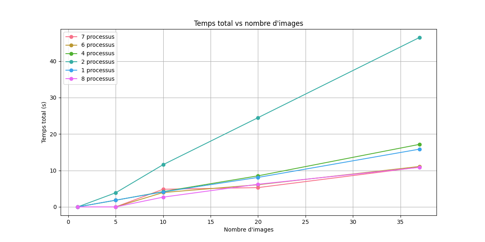
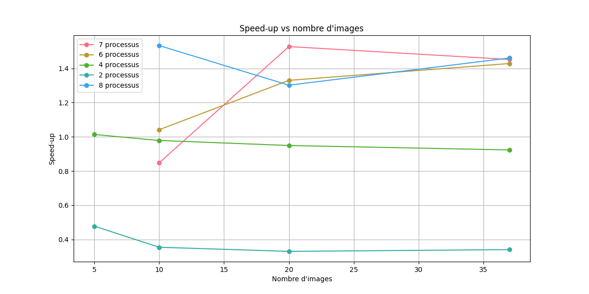

Voici ma configuration
```
Architecture:          ARM64
Modèle:               Apple M1 Pro
Cœurs par package:    8
Nombre de cœurs:      8
Threads par cœur:     1
Nombre total threads: 8

Cache L2 Performance Cores (P-cores):
  Taille:             12 MB (12582912 bytes)
  Cœurs par cache L2: 3

Cache L2 Efficiency Cores (E-cores):
  Taille:             4 MB (4194304 bytes)
  Cœurs par cache L2: 2
```

Pour exécuter les scripts :
Activer l'environement virtuel:
```bash
source venv/bin/Activate
```

```bash
mpirun -n N python movie_filter_parallel.py
```
où N est le nombre de processus à utiliser (dans la limite du nombre de cœurs disponibles).


# Q1
pour le traitement, j'ai choisi de découper les entrées en fonction uniquement des images. 
Le jeu de données ici peut être découpé selon plusieur variables:
 - pixel
 - dimension
 - images

Ici le traitement il traitement par pixel serait nécéssairement sous-optimal car la convolution est déjà une opération optimisé par scipy, donc il faudrait réimplémenter cette version en python pour la parraléliser. 
Or le découpage par dimension ou par images est identique, car l'opération de convolution s'effectue à chaque fois sur une seule convolution, c'est un "Embarrassingly parallel algorithms".
Pour autant l'implémentation ici est plus avantageuse avec un découpage par image car lorsqu'on ouvre une image, on ouvre et on traite les 3 dimensions de l'image. Or si on découpait par dimension, il faudrait envoyer et recevoir l'intégralité de la dimension, ce qui ralentirait le calcul.
Ainsi la version optimale du découpage est un découpage par image.
Voici les sorties du traitement:


En effet l'opération de convolution est effectué sur chaque dimension de l'image de façon indépendante, ainsi on pourrait aussi simplement parraléliser

### Temps d'exécution en fonction du nombre d'images


Le graphique ci-dessus montre le temps total d'exécution en fonction du nombre d'images traitées pour différents nombres de processus. On observe que l'augmentation du nombre de processus ne réduit pas toujours le temps d'exécution comme on pourrait s'y attendre.

### Speed-up en fonction du nombre d'images


Ce graphique illustre le facteur d'accélération (speed-up) obtenu pour différents nombres de processus par rapport à l'exécution séquentielle.

### Tableau récapitulatif des performances

| Nombre de processus | Speed-up moyen |
|-------------------|----------------|
| 2 | 0.38x |
| 4 | 0.97x |
| 6 | 1.27x |
| 7 | 1.28x |
| 8 | 1.43x |

## Analyse des résultats

1. **Performances avec peu de processus (2-4)**
   - Avec 2 processus, on observe une dégradation significative des performances (speed-up de 0.38x)
   - Avec 4 processus, les performances sont proches de l'exécution séquentielle (0.97x)
   - Cette contre-performance s'explique par l'overhead de communication et de synchronisation MPI qui surpasse les gains de la parallélisation

2. **Performances avec plus de processus (6-8)**
   - Le speed-up devient positif à partir de 6 processus (1.27x)
   - Une légère amélioration est observée avec 7 processus (1.28x)
   - Le meilleur résultat est obtenu avec 8 processus (1.43x)
   - L'amélioration reste modeste malgré l'augmentation du nombre de processus

3. **Limitations observées**
   - Le gain de performance maximal (1.43x) est bien inférieur au nombre de processus utilisés
   - La courbe de speed-up montre une tendance à la saturation
   - Les coûts de communication et de synchronisation MPI limitent significativement l'efficacité de la parallélisation
   - La nature du problème (traitement d'images) implique des transferts de données importants qui peuvent créer des goulots d'étranglement
